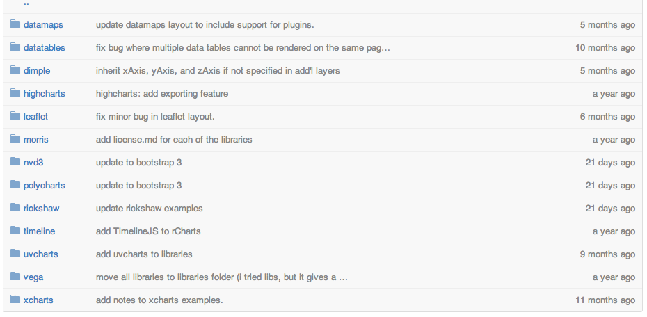

## Multiple Libraries Supported

</img>


--- #rmapssite

--- &interactive2 height:160

<textarea class='interactive' id='interactive{{slide.num}}' data-cell='{{slide.num}}' data-results='asis' style='display:none'>library(rCharts)
map <- Leaflet$new()
map$setView(c(51.505, -0.09), zoom = 13)
map$tileLayer(provider = 'Stamen.Watercolor')
map$marker(c(51.5, -0.09), bindPopup = 'Hi. I am a popup')
map</textarea>


---

<a class='example'>MapBox</a>


```r
rmeetups = readRDS('data/rmeetups.rds')
L1 <- Mapbox2()
L1$set(width = 1600, height = 800, dom = 'map', map_id = 'ramnathv.i2lkbedb')
L1$setView(c(-30, 130), 2)
L1$set(geojson = toGeoJSON(rmeetups), hover = TRUE)
L1
```

<iframe src=' assets/fig/unnamed-chunk-8.html ' scrolling='no' frameBorder='0' seamless class='rChart mapbox2 ' id=iframe- map ></iframe> <style>iframe.rChart{ width: 100%; height: 400px;}</style>


---

<a class='example'>DataMaps</a>


```r
library(rMaps)
ichoropleth(Crime ~ State, data = violent_crime, animate = "Year")
```

<iframe src=' assets/fig/unnamed-chunk-9.html ' scrolling='no' frameBorder='0' seamless class='rChart datamaps ' id=iframe- chart17825053c1f3 ></iframe> <style>iframe.rChart{ width: 100%; height: 400px;}</style>


---

<a class='example'>Crosslet</a>


```r
d1 <- crosslet(
  x = "country", 
  y = c("web_index", "universal_access"), 
  data = web_index, 
  map = map_world(geo = list(url = 'world.topo.json'))
)
d1
```

<iframe src=' assets/fig/unnamed-chunk-11.html ' scrolling='no' frameBorder='0' seamless class='rChart crosslet ' id=iframe- chart17822ae261b8 ></iframe> <style>iframe.rChart{ width: 100%; height: 400px;}</style>


--- .segue .nobackground

## More Interactivity

--- &interactive2 height:75

<a class='example'>AngularJS</a>

<textarea class='interactive' id='interactive{{slide.num}}' data-cell='{{slide.num}}' data-results='asis' style='display:none'>library(rCharts)
n1 <- nPlot(mpg ~ wt, data = mtcars, type = 'scatterChart', group = 'gear')
n1$addControls('x', 'wt', names(mtcars))
n1</textarea>

--- .bigger

## UI

<a class='example'>Shiny</a>


```r
ui = bootstrapPage(
  sidebarPanel(
    selectInput('sex', 'Choose Sex', c('Male', 'Female')),
    selectInput('type', 'Choose Type', 
      c('multiBarChart', 'multiBarHorizontalChart')
    )
  ),
  mainPanel(
    chartOutput('nvd3plot', 'nvd3')
  )
)
```


--- .bigger

## Server

<a class='example'>Shiny</a>


```r
server = function(input, output){
  output$nvd3plot <- renderChart2({
    haireye <- as.data.frame(HairEyeColor)
    n1 <- nPlot(Freq ~ Hair, group = 'Eye', type = input$type,
      data = subset(haireye, Sex == input$sex)
    )
    n1$set(width = 600)
    n1
  })
}
```


---

## Interactive Chart with Shiny Controls

<div class="row-fluid">
  <div class="span4">
    <form class="well">
      <label class="control-label" for="sex">Choose Sex</label>
      <select id="sex"><option value="Male" selected>Male</option>
<option value="Female">Female</option></select>
      <script type="application/json" data-for="sex" data-nonempty="">{}</script>
      <label class="control-label" for="type">Choose Type</label>
      <select id="type"><option value="multiBarChart" selected>multiBarChart</option>
<option value="multiBarHorizontalChart">multiBarHorizontalChart</option></select>
      <script type="application/json" data-for="type" data-nonempty="">{}</script>
    </form>
  </div>
  <div class="span8">
    <div id="nvd3plot" class="shiny-html-output nvd3 rChart"></div>
  </div>
</div>


--- .segue .nobackground

## Custom Visualizations


--- .bigger

## Generate Timeline


```r
sachin = readRDS('data/sachin.rds')
m = Timeline$new()
m$main(
  headline =  "100 Centuries of Sachin",
  type = 'default',
  text = "A Tribute to Sachin Tendulkar",
  startDate =  "1990,08,14",
  asset = list(
    media = 'http://www.youtube.com/watch?v=6PxAandi6r4'
  )
)
m$config(font = "Merriweather-Newscycle")
m$event(sachin)
```


---

<iframe src='assets/fig/sachin.html' width = 1200 height=600></iframe>

---

<iframe src='http://rcharts.io/viewer/?5649396' width = 1200 height=600></iframe>

--- .bigger

## Share Easily


```r
# save
n1$save('mychart.html')
# publish
n1$publish('mychart.html')
```


--- .segue .nobackground

## How it Works?

---

<iframe src="http://jsfiddle.net/RR8Ub/embedded/result/presentation" height=600 width=100%></iframe>


---

<iframe src="http://jsfiddle.net/RR8Ub/embedded/resources/presentation/" height=600 width=100%></iframe>

--- .bigger


```yaml
uvcharts:
  jshead: [js/d3.v3.min.js, js/uvcharts.js]
  cdn:
    jshead:
      - "http://cdnjs.cloudflare.com/ajax/libs/d3/3.2.2/d3.v3.min.js"
      - "http://imaginea.github.io/uvCharts/js/uvcharts.js"
```

---

<iframe src="http://jsfiddle.net/RR8Ub/embedded/js/presentation/" height=600 width=100%></iframe>

--- .RAW .bigger .center

## Layout

```js
<script>
  var graphdef = {{{ chartParams }}}
  var config = {
    meta: {
      position: "#{{ chartId }}"
    }
  }
  var chart = uv.chart(graphdef.type, graphdef, config)
</script>
```

---

## Data

<!-- html table generated in R 3.1.0 by xtable 1.7-3 package -->
<!-- Tue Jul  1 13:38:44 2014 -->
<TABLE border=1>
<TR> <TH>  </TH> <TH> Hair </TH> <TH> Eye </TH> <TH> Sex </TH> <TH> Freq </TH>  </TR>
  <TR> <TD align="right"> 1 </TD> <TD> Black </TD> <TD> Brown </TD> <TD> Male </TD> <TD align="right"> 32.00 </TD> </TR>
  <TR> <TD align="right"> 2 </TD> <TD> Brown </TD> <TD> Brown </TD> <TD> Male </TD> <TD align="right"> 53.00 </TD> </TR>
  <TR> <TD align="right"> 3 </TD> <TD> Red </TD> <TD> Brown </TD> <TD> Male </TD> <TD align="right"> 10.00 </TD> </TR>
  <TR> <TD align="right"> 4 </TD> <TD> Blond </TD> <TD> Brown </TD> <TD> Male </TD> <TD align="right"> 3.00 </TD> </TR>
  <TR> <TD align="right"> 5 </TD> <TD> Black </TD> <TD> Blue </TD> <TD> Male </TD> <TD align="right"> 11.00 </TD> </TR>
  <TR> <TD align="right"> 6 </TD> <TD> Brown </TD> <TD> Blue </TD> <TD> Male </TD> <TD align="right"> 50.00 </TD> </TR>
  <TR> <TD align="right"> 7 </TD> <TD> Red </TD> <TD> Blue </TD> <TD> Male </TD> <TD align="right"> 10.00 </TD> </TR>
  <TR> <TD align="right"> 8 </TD> <TD> Blond </TD> <TD> Blue </TD> <TD> Male </TD> <TD align="right"> 30.00 </TD> </TR>
  <TR> <TD align="right"> 9 </TD> <TD> Black </TD> <TD> Hazel </TD> <TD> Male </TD> <TD align="right"> 10.00 </TD> </TR>
  <TR> <TD align="right"> 10 </TD> <TD> Brown </TD> <TD> Hazel </TD> <TD> Male </TD> <TD align="right"> 25.00 </TD> </TR>
   </TABLE>


--- .center .medium

## JSON

```js
"dataset": {
  "Brown": [
    {"name": "Black", "value": 32 },
    {"name": "Brown", "value": 53 },
    {"name": "Red","value":  10},
    {"name": "Blond", "value": 3} 
  ],
  "Blue": [
    {"name": "Black", "value": 11 },
    {"name": "Brown", "value": 50 },
    {"name": "Red","value":  10},
    {"name": "Blond", "value": 30} 
  ],
  ...
} 
```

--- .bigger

## Wrap into Function


```r
uPlot <- function(x, y, data, group = NULL, type, ...){
  dataset = make_dataset(x = x, y = y, 
    data = data, 
    group = group
  )
  u1 <- rCharts$new()
  u1$setLib("uvcharts")
  u1$set(
    type = type,
    categories = names(dataset),
    dataset = dataset
  )
  return(u1)
}
```


--- &interactive2 height:40 lib:uvcharts

<a class='example'>uvCharts</a>

<textarea class='interactive' id='interactive{{slide.num}}' data-cell='{{slide.num}}' data-results='asis' style='display:none'>library(rCharts)
uPlot(x = 'Sex', y = 'Freq', data = as.data.frame(HairEyeColor), group = 'Hair', type = 'Bar')</textarea>

---

## References

1. [rCharts](http://rcharts.io)
2. [rMaps](http://rmaps.github.io)
3. [rCharts Gallery](http://rcharts.io/gallery)


---

## Credits

1. Kenton Russel and Thomas Reinholdsson for coauthoring rCharts.
2. [Jeroen Ooms](@opencpu) for [OpenCPU](http://opencpu.io)
3. Authors of all the JS Libraries I have liberally used.

--- .segue .nobackground

## Thank You


<style>iframe.uvcharts{height: 600px;}</style>


